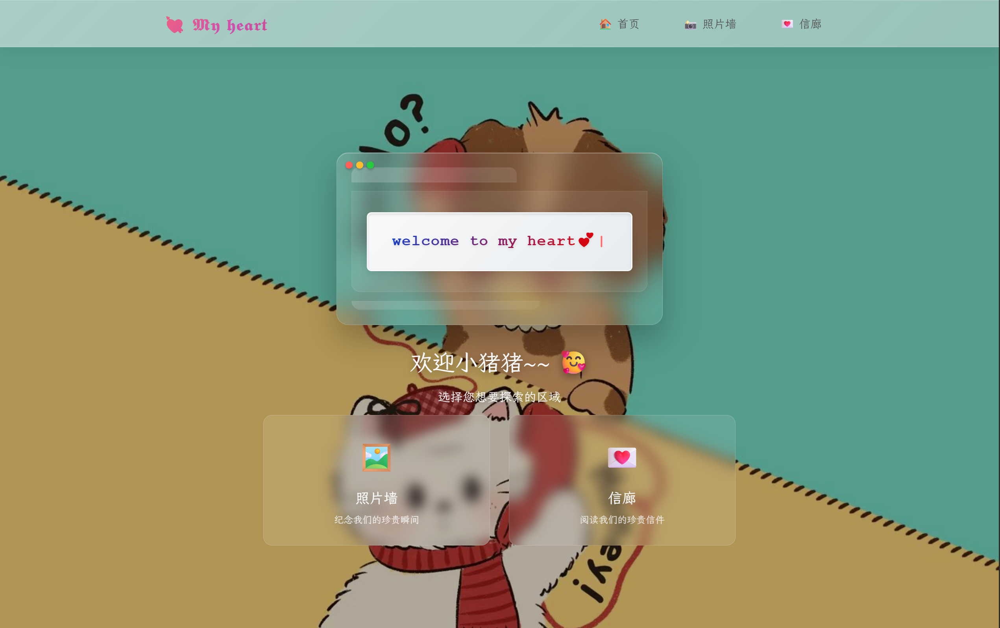
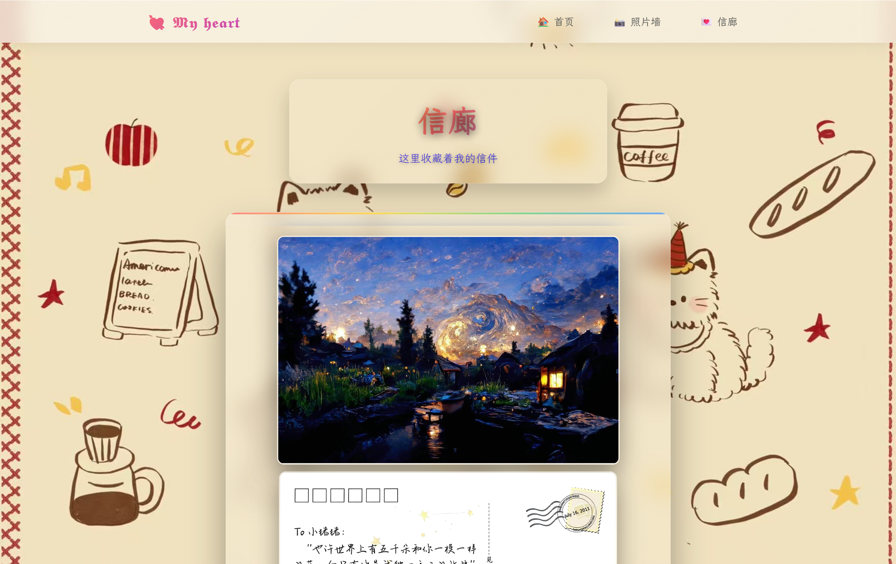

# 💝 My-Heart 个人情感网站

> 一个精美的个人情感纪念网站，通过简单配置即可创建个性化的照片墙和信廊，记录和展示珍贵的回忆和情感！


---

## 📌 目录
- [功能特性](#-功能特性)
- [界面预览](#-界面预览)
- [安装与使用](#-安装与使用)
- [技术栈](#%EF%B8%8F-技术栈)
- [项目结构](#-项目结构)
- [自定义指南](#-自定义指南)
- [使用场景](#-使用场景)
- [许可证](#-许可证)

---

## ✨ 功能特性
| 特性 | 说明 |
|------|------|
| 🖼️ **精美照片墙** | 支持多张照片展示，带缩放和拖拽功能的图片查看器 |
| 💌 **温馨信廊** | 展示珍贵信件和文字内容，支持打字机效果 |
| 🎨 **现代化界面** | 采用毛玻璃效果和渐变色设计，视觉体验出色 |
| 📱 **响应式设计** | 完美适配桌面和移动设备 |
| 🎵 **背景字体** | 支持自定义字体，提升整体美感 |
| 🔍 **图片缩放** | 支持鼠标滚轮缩放、拖拽移动和键盘快捷键 |

---

## 🎨 界面预览

| 主页欢迎 | 照片墙 | 信廊 |
|---------|-----------|----------|
|  |  |  |

---

## 🚀 安装与使用

### 1️⃣ 环境准备
```bash
# 确保安装了Node.js 18+
node --version
npm --version
```

### 2️⃣ 安装依赖
```bash
# 克隆仓库（如果适用）
git clone <your-repo-url>

# 进入项目目录
cd my-heart

# 安装项目依赖
npm install
```

### 3️⃣ 创建必要的目录和文件
由于项目在.gitignore中设置了以下路径，需要手动创建相应目录和文件：

```bash
# 创建图片目录
mkdir -p public/img/gallery
mkdir -p public/img/letter-gallery

# 创建配置文件目录
mkdir -p public/gallery-wall
mkdir -p public/letter-gallery
```

### 4️⃣ 配置照片墙
创建 `public/gallery-wall/gallery-wall-config.json` 文件：

```json
{
  "backgroudImage": "/img/gallery/background.jpg",
  "randomOrder": true,
  "pictureList": [
    {
      "imageSrc": "/img/gallery/photo1.jpg",
      "nameTag": "甜蜜回忆💗",
      "timeTag": "2024-01-01",
      "herf": ""
    },
    {
      "imageSrc": "/img/gallery/photo2.jpg",
      "nameTag": "美好时光✨",
      "timeTag": "2024-02-14",
      "herf": ""
    }
  ]
}
```

### 5️⃣ 配置信廊
创建 `public/letter-gallery/letter-gallery-config.json` 文件：

```json
{
  "backgroundImage": "/bg/letter-background.jpg",
  "randomOrder": false,
  "letterList": [
    {
      "imageList": [
        "/img/letter/your-letter-image1.jpg",
        "/img/letter/your-letter-image2.jpg"
      ],
      "nameTag": "信件标题💌",
      "timeTag": "2025.01.01",
      "herf": ""
    },
    {
      "imageList": [
        "/img/letter/your-letter-image3.jpg"
      ],
      "nameTag": "另一封信件✨",
      "timeTag": "2025.01.02",
      "herf": ""
    }
  ]
}
```

### 6️⃣ 添加资源文件

将您的资源文件放入相应目录：
```bash
# 信廊背景图片
public/bg/letter-background.jpg

# 信廊信件图片
public/img/letter/your-letter-image1.jpg
public/img/letter/your-letter-image2.jpg

# 照片墙背景图片
public/img/gallery/background.jpg

# 照片墙照片
public/img/gallery/photo1.jpg
public/img/gallery/photo2.jpg
```

### 7️⃣ 运行项目
```bash
# 开发模式
npm run dev

# 构建生产版本
npm run build

# 启动生产服务器
npm start
```

---

## 🛠️ 技术栈

| 分类 | 技术 | 版本 | 说明 |
|---|---|---|---|
| 前端框架 | Next.js | 14+ | React全栈框架 |
| 开发语言 | TypeScript | 5.0+ | 类型安全的JavaScript |
| 样式方案 | CSS Modules | - | 组件级样式隔离 |
| 动画库 | Framer Motion | 10+ | 高性能动画效果 |
| 字体渲染 | @font-face | - | 自定义字体支持 |
| 构建工具 | Webpack | 5+ | 模块打包工具 |

---

## 📁 项目结构
```
my-heart/
├── app/                    # Next.js App Router目录
│   ├── components/         # 公共组件
│   ├── gallery-wall/       # 照片墙页面
│   ├── letter-gallery/     # 信廊页面
│   ├── globals.css         # 全局样式
│   ├── home.module.css     # 首页样式
│   ├── pages/              # 首页
│   └── layout.tsx          # 根布局
├── public/                 # 静态资源
│   ├── img/                # 图片资源
│   │   └── gallery/        # 照片墙图片（需手动创建）
│   ├── gallery-wall/       # 照片墙配置（需手动创建）
│   │   └── gallery-wall-config.json
│   ├── letter-gallery/     # 信廊配置（需手动创建）
│   │   └── letter-gallery-config.json
│   ├── bg/                 # 背景图片
│   └── woff/               # 字体文件
├── next.config.mjs         # Next.js配置
└── package.json            # 项目依赖
```

---

## 🎨 自定义指南

### 修改网站标题和欢迎语
编辑 `app/page.tsx` 文件中的欢迎信息：

```typescript
const welcomeMessage = "welcome to my heart💕";
```

### 自定义字体
在 `app/globals.css` 中修改字体配置：

```css
@font-face {
  font-family: 'xwwk';
  src: url('/woff/霞鹜文楷.woff2') format('woff2');
  font-display: swap;
}
```

### 添加新照片
1. 将新照片放入 `public/img/gallery/` 目录
2. 在 `public/gallery-wall/gallery-wall-config.json` 中添加配置：

```json
{
  "imageSrc": "/img/gallery/新照片.jpg",
  "nameTag": "新回忆🌟",
  "timeTag": "2024-03-08",
  "herf": ""
}
```

### 修改主题颜色
编辑CSS变量或直接修改样式文件中的颜色值：

```css
/* 在相应的CSS模块文件中修改 */
.printerMachine {
  background: linear-gradient(135deg, rgba(255, 255, 255, 0.15), rgba(255, 255, 255, 0.05));
}
```

---

## 💝 使用场景
- 个人情感纪念网站
- 情侣间的专属空间
- 家庭照片展示墙
- 重要时刻的记录和分享
- 个性化电子相册

---

## 📝 许可证
[MIT License](LICENSE) © 2025 Aurorp1g

---

## 💡 提示
- 图片建议使用WebP或JPG格式，优化加载速度
- 配置文件使用JSON格式，确保语法正确
- 图片文件名避免使用中文和特殊字符
- 定期备份配置文件和数据
- 在生产环境部署前进行充分测试

## 🔧 故障排除

### 常见问题
1. **图片不显示**：检查图片路径和文件名是否与配置文件一致
2. **配置不生效**：确保JSON文件格式正确，无语法错误
3. **字体不加载**：确认字体文件路径正确且格式支持

### 开发建议
- 使用Chrome DevTools调试样式和布局
- 利用Next.js的热重载功能快速开发
- 定期清理浏览器缓存查看最新效果

---

**开始创建属于您的专属情感空间吧！** 💖
        